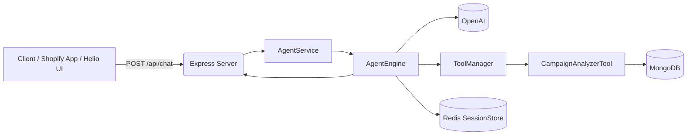
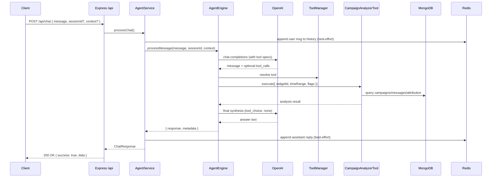

## Lio: The Helio AI Agent (for Shopify) — witty, gritty, and agent-y

Meet Lio, your slightly over-caffeinated agent for the Helio AI platform. Lio analyzes campaigns, summarizes chats, and soon will build segments, chatflows, and journeys like it’s meal prep Sunday.

If your Shopify store wants fewer “why is deliverability sad?” moments and more “oh wow, look at that CTR” celebrations, you’re in the right repo.

### TL;DR

- Runs an Express API on port 8080 with `/api/chat` as the main entrypoint
- Uses OpenAI for reasoning and tools for data-fetching/analysis
- Stores session history in Redis (optional) and data in MongoDB
- Ships with a production-grade Campaign Analyzer tool
- Built to be extended with more agentic tools (segments, chat analyzer, builders)

---

## Table of Contents

- Overview
- Architecture
- Endpoints
- Setup & Run
- Environment
- Tools & Extensibility
- Campaign Analyzer (P1)
- Roadmap (P1/P2)
- Security & Privacy
- Troubleshooting
- Contributing

---

## Overview

Lio is an agentic backend for Helio AI to help Shopify brands:

- Analyze WhatsApp campaigns (deliverability, engagement, error-code insights) and recommend fixes
- Summarize chats and generate responses
- Soon: build segments, chatflows, and customer journeys with prompt-driven UX

Lio’s brain is OpenAI; its hands are “tools” (database-backed functions) orchestrated by an execution graph.

---

## Architecture

### Component map



### Request flow (high-level)



Key internals:

- `src/routes/chat.routes.ts`: HTTP routes mounted at `/api`
- `AgentService`: orchestrates tools and sessions
- `AgentEngine`: manages LLM calls, tool-calls, graph execution, metrics
- `ToolManager`: registers and configures tools
- `CampaignAnalyzerTool`: production-grade analyzer for campaigns
- `SessionStore` (Redis): maintains short chat history for context-awareness

---

## Endpoints

- POST `/api/chat`
  - Body: `{ message: string, sessionId?: string, context?: Record<string, any> }`
  - Returns: `{ response, sessionId, metadata, context? }`
  - Notes: Include `context.widgetId` for campaign analysis; persisted into session metadata.

- GET `/api/chat/session/:sessionId`
  - Returns current session snapshot.

- DELETE `/api/chat/session/:sessionId`
  - Clears a session.

- GET `/api/chat/stats`
  - Returns runtime metrics (requests, sessions, tool stats).

- GET `/api/chat/health`
  - Simple health signal for the chat service.

Example request

```bash
curl -X POST http://localhost:8080/api/chat \
  -H 'Content-Type: application/json' \
  -d '{
    "message": "Compare my last 2 campaigns and tell me why deliverability dipped.",
    "context": { "widgetId": "507f1f77bcf86cd799439011", "store": "my-shopify-store" }
  }'
```

---

## Setup & Run

Prerequisites

- Node 18+ and Yarn 1.x
- MongoDB (URI in env)
- Redis optional (recommended for session history)
- OpenAI API key

Install

```bash
yarn
```

Configure env

```bash
cp env.example .env
# fill OPENAI_API_KEY, MONGO_URI, etc.
```

Run

```bash
yarn dev        # dev with nodemon on :8080
yarn build      # compile to dist
yarn start      # run dist/index.js
```

Quality

```bash
yarn lint
yarn typecheck
yarn format
```

---

## Environment

From `env.example` (most important vars):

- OPENAI_API_KEY, OPENAI_MODEL (default `gpt-5-mini`)
- MONGO_URI, DB_NAME
- REDIS_HOST, REDIS_PORT, REDIS_PASSWORD, REDIS_DB (optional)
- AGENT_TEMPERATURE, AGENT_MAX_TOKENS, AGENT_MEMORY_ENABLED, AGENT_RETRY_ENABLED
- MAX_SESSIONS, SESSION_TIMEOUT, MEMORY_LIMIT

---

## Tools & Extensibility

Tools are classes extending `BaseTool` and registered via `ToolManager`.

- Auto-registered in `AgentService` using `ToolFactory`
- Each tool exposes:
  - `execute(input)` with retry, caching, and rate limits
  - `getOpenAIFunctionSpec()` for function/tool calling

Add a tool (sketch):

1. Create `src/agent/tools/my-tool.ts` with a subclass of `BaseTool`
2. Export in `src/agent/tools/index.ts` and add to `ToolFactory.toolClasses`
3. Restart the server (auto-registration on boot)

---

## Campaign Analyzer (P1)

The star of the show today.

Name: `analyzeCampaigns` (category: `analytics`)

Inputs

- `widgetId` (required): MongoDB ObjectId of the Helio widget
- `timeRange` (optional): one of `7d | 14d | 30d | 90d | all` (default `14d`)
- `includeFailed` (default true)
- `includeMessages` (default true)
- `includeAttribution` (default true)

What it does

- Queries campaigns, templates, messages, and attribution
- Computes delivery/read/click rates, engagement, failures
- Surfaces error codes like 131049/131048/131026 with root causes and fixes
- Returns optimization suggestions and best/worst performers

Example tool-call (conceptual)

```json
{
  "tool": "analyzeCampaigns",
  "args": {
    "widgetId": "507f1f77bcf86cd799439011",
    "timeRange": "30d",
    "includeFailed": true,
    "includeMessages": true,
    "includeAttribution": true
  }
}
```

LLM prompt policy (summarized)

- Prefer tools when data is needed; do not leak internal IDs
- Default time range to 14d; reuse cached results in-session
- Output is concise with sections: Summary, Problems, Root causes, Optimizations, Attribution

---

## Roadmap

- P1 — Campaign analyzer and builder
  - Analyze two campaigns, explain deliverability, error codes, optimization paths
  - Campaign creator: suggest templates, best send times, target segment (segment recos are P2)
- P1 — Chat Analyzer
  - Summarize all conversations, surface pain points, generate AI responses
- P2 — Segment analyzer and builder
  - Example: “past 2 campaigns” behavior over a segment, interaction lift, build segments
- P2 — Chatflow builder with prompt
- P2 — Journey Builder with prompt

Status today: Campaign Analyzer is implemented. Others are stubs-to-be.

---

## Security & Privacy

- Sensitive IDs like `widgetId` are redacted from final answers
- Redis is optional; if missing, history falls back to stateless behavior
- Validate all inputs server-side; tool calls enforce `widgetId`

---

## Troubleshooting

- “OPENAI_API_KEY is not set” — fill `.env`
- “Database not connected” — ensure `MONGO_URI` reachable and MongoDB is running
- Redis errors? Service runs without Redis; history simply won’t persist
- 500s on `/api/chat` — check server logs; enable `LOG_LEVEL=info` or higher

---

## Contributing

Bring your tools. Prefer:

- Descriptive names, explicit types, early returns
- No swallowing errors; meaningful logging
- Lint clean, type safe, and documented

If you ship a tool that increases deliverability and revenue, Lio will name a variable after you. Maybe.
